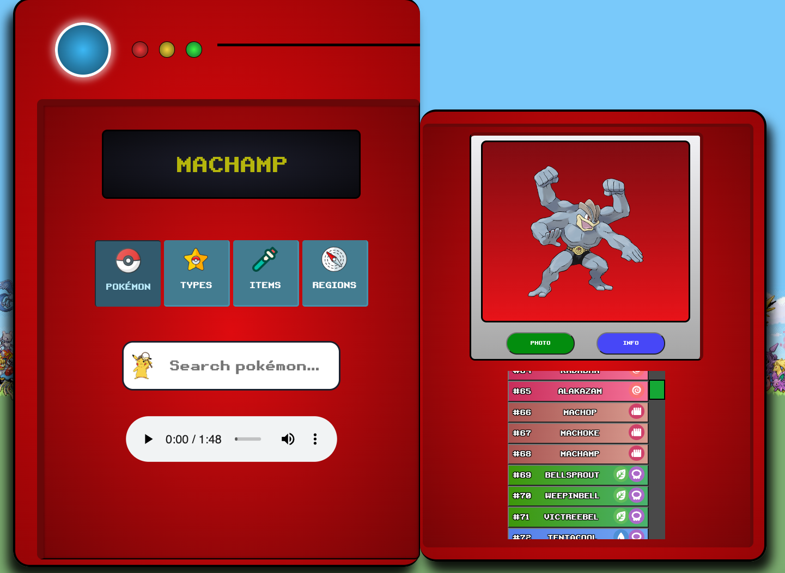

# POKEDEX

Discover the world of Pokémon with our Pokedex app! This comprehensive application, developed using React and TypeScript, serves as a one-stop hub for all your Pokémon needs. Dive into a wealth of information about every Pokémon, explore various types, browse through an extensive collection of items, and navigate detailed region maps.

### Key Features:

- Pokémon Database: Access detailed information on all Pokémon species.
- Type Encyclopedia: Explore the various types of Pokémon and their attributes.
- Item Catalog: Browse through a curated collection of in-game items.
- Region Maps: Navigate through beautifully crafted maps representing different Pokémon regions.

### Technology Stack:

- Frontend: React, TypeScript
- API: Pokémon API
- Testing: Cypress

### Development Journey:

This project is the result of dedicated work during the Mindera Frontend Bootcamp of 2023. From conceptualization to implementation, our team crafted a user-friendly and feature-rich Pokedex app to bring the Pokémon world to your fingertips.

Embark on a journey of exploration and nostalgia—uncover the vast universe of Pokémon in this meticulously designed Pokedex app.

## PREVIEW



## How to run

```bash
yarn install
yarn dev
```

## How to run the tests

```bash
yarn test
```

## Tasks

- [x] Api Communication
- [x] Left Side Components
- [x] Right Side Components
- [x] Display Monitor
- [x] Display Info
- [x] Menu Buttons
- [x] Pokemon Types
- [x] Pokemon Items
- [x] Regions
- [x] Mobile Component
- [x] Tablet Component
- [x] Cypress component testing
- [x] Production deploy to github pages

## DEVELOPED BY:

### Bruno Machado

- [GITHUB](https://github.com/brunomachadors)
- [LINKEDIN](https://www.linkedin.com/in/brunomrs/)
- [INSTAGRAM](https://www.instagram.com/brunomachadors/)

### MY FAVOURITE POKEMON


## API

### POKEMON

- [POKEMON API API](https://pokeapi.co/)

## All packages

### AXIOS

This project is using action as a method of comunication with the endpoins.

- [Axios Oficial Page](https://axios-http.com/docs/intro)

### STYLED COMPOMENTS

Almost all compoments are using styled compoments
[Style Compoments Website](https://styled-components.com/)

### REDUX

This project was made using Redux. Redux provides a central store to hold the state, and any component can access and subscribe to this store to stay informed about state changes.

You can use Redux for managing the state of a web application. It follows a predictable state management pattern, where the entire application state is stored in a single JavaScript object, and changes to the state are made through actions.
These actions are dispatched by components and processed by reducers, which are pure functions responsible for updating the state.

[Redux Website](https://redux.js.org/)

### React + TypeScript + Vite

This template provides a minimal setup to get React working in Vite with HMR and some ESLint rules.

Currently, two official plugins are available:

- [@vitejs/plugin-react](https://github.com/vitejs/vite-plugin-react/blob/main/packages/plugin-react/README.md) uses [Babel](https://babeljs.io/) for Fast Refresh
- [@vitejs/plugin-react-swc](https://github.com/vitejs/vite-plugin-react-swc) uses [SWC](https://swc.rs/) for Fast Refresh
